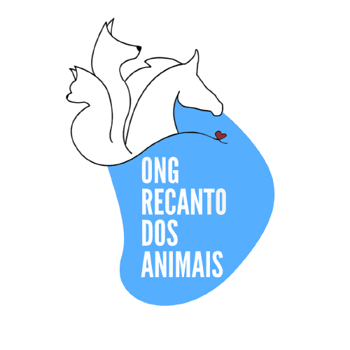

# 🐾 ONG Recanto - Website Institucional

 <!-- Substitua pelo caminho correto da logo se necessário -->

> Este repositório contém o código-fonte do site oficial da **ONG Recanto**. Este projeto é desenvolvido de forma voluntária e é **Open Source**, disponibilizado livremente para que outras ONGs de proteção animal possam utilizá-lo como base para criar seus próprios portais na web.

## 📖 Sobre o Projeto

O objetivo deste projeto é fornecer uma presença digital profissional e acessível para ONGs que necessitam divulgar seu trabalho, arrecadar doações e conscientizar a população sobre a causa animal.

O site foi construído com tecnologias modernas para garantir rapidez, responsividade (funciona bem em celulares e computadores) e facilidade de manutenção.

### ✨ Funcionalidades

O site conta com as seguintes seções principais:

-   **LinkTree (Home/Contatos)**: Uma página inicial estilo "LinkTree" que centraliza os canais de comunicação, redes sociais e links importantes da ONG.
-   **Sobre Nós**: Uma seção dedicada a contar a história da ONG, sua missão, visão e valores.
-   **Como Ajudar**: Informações claras sobre como as pessoas podem contribuir (doações financeiras, voluntariado, apadrinhamento, etc).
-   **Castrar, Por Quê?**: Uma página educativa focada na conscientização sobre a importância da castração para o controle populacional e saúde dos animais.

## 🚀 Tecnologias Utilizadas

Este projeto foi desenvolvido utilizando as seguintes tecnologias:

-   **[React](https://reactjs.org/)**: Biblioteca JavaScript para construção de interfaces de usuário.
-   **[Vite](https://vitejs.dev/)**: Ferramenta de build rápida e leve para desenvolvimento web moderno.
-   **[TypeScript](https://www.typescriptlang.org/)**: Superset do JavaScript que adiciona tipagem estática, garantindo maior segurança e menos erros no código.
-   **[Styled Components](https://styled-components.com/)**: Biblioteca para estilização de componentes utilizando CSS-in-JS.
-   **[React Router](https://reactrouter.com/)**: Biblioteca para gerenciamento de rotas e navegação no React.

## 🛠️ Pré-requisitos

Antes de começar, certifique-se de ter instalado em sua máquina:

-   **[Node.js](https://nodejs.org/)** (Recomendamos a versão LTS, ou v20+ conforme configuração do projeto).
-   Um gerenciador de pacotes como **npm**, **yarn** ou **pnpm**.

## 📦 Instalação e Execução

Siga os passos abaixo para rodar o projeto localmente:

1.  **Clone o repositório**:

    ```bash
    git clone https://github.com/victorradael/ong_recanto.git
    ```

2.  **Acesse a pasta do projeto**:

    ```bash
    cd ong_recanto
    ```

3.  **Instale as dependências**:

    Se estiver usando `npm`:
    ```bash
    npm install
    ```
    Ou se estiver usando `yarn`:
    ```bash
    yarn
    ```

4.  **Inicie o servidor de desenvolvimento**:

    Se estiver usando `npm`:
    ```bash
    npm run dev
    ```
    Ou se estiver usando `yarn`:
    ```bash
    yarn dev
    ```

5.  **Acesse o site**:
    O terminal irá mostrar o endereço local (geralmente `http://localhost:5173/`). Abra este link no seu navegador.

## 🎨 Como Personalizar para sua ONG

Se você é de outra ONG e deseja usar este site, siga este guia básico para personalização:

1.  **Textos e Conteúdo**: Navegue pelas pastas em `src/pages/` (como `About`, `HowToHelp`, etc.) e edite os arquivos `.tsx` para alterar os textos conforme a realidade da sua ONG.
2.  **Imagens**: Substitua as imagens na pasta `src/assets/` ou altere os caminhos nas importações dos componentes.
3.  **Cores e Estilos**: Verifique se há um arquivo de tema global (geralmente em `src/styles/` ou `src/utils/theme.ts`) para alterar a paleta de cores e alinhar com a identidade visual da sua organização.
4.  **Links e Contatos**: Atualize os links de redes sociais e contatos, especialmente na página `LinkTree` e no componente `Footer`.

## 🤝 Contribuição

Contribuições são muito bem-vindas! Se você é desenvolvedor e quer ajudar a melhorar este projeto para que ele sirva ainda melhor a causa animal:

1.  Faça um **Fork** do projeto.
2.  Crie uma **Branch** para sua feature (`git checkout -b feature/MinhaFeature`).
3.  Faça o **Commit** das suas mudanças (`git commit -m 'Adiciona nova feature'`).
4.  Faça o **Push** para a Branch (`git push origin feature/MinhaFeature`).
5.  Abra um **Pull Request**.

## 📄 Licença

Este projeto está sob a licença **MIT**. Isso significa que você pode usá-lo, modificá-lo e distribuí-lo livremente, inclusive para fins não comerciais de outras ONGs. Veja o arquivo [LICENSE](LICENSE) para mais detalhes.

---

<p align="center">
  Feito com 💜 por voluntários em prol da causa animal.
</p>
